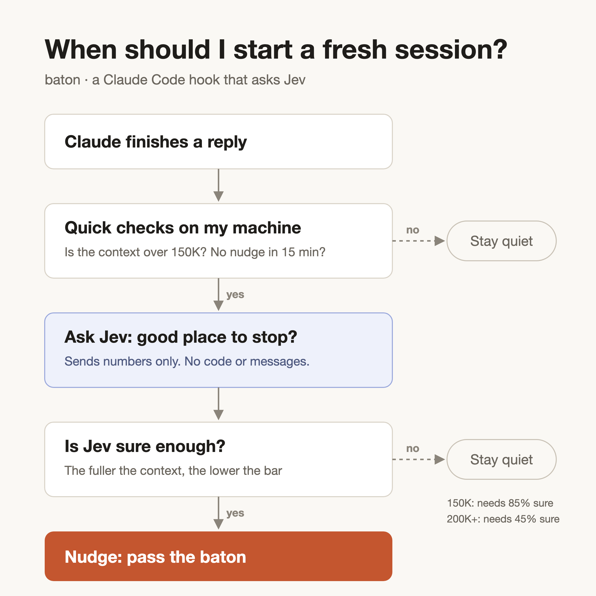

<div align="center">

# baton

**Know when to pass a Claude Code session to a fresh one, before context gets expensive.**

[](LICENSE)


</div>

Long Claude Code sessions get expensive, because everything in context is re-read on every turn. Starting fresh fixes that, but only if you stop at the right moment. Stop mid-task and you lose your place.

baton watches your session. Once it gets big, it asks a decision model whether this looks like a natural stopping point, and nudges you when it does. The backend is your choice: [Jev](https://typesafe.ai) from TypeSafe (hosted) by default, or a self-hosted open-weights alternative like [Laya](https://github.com/NandhaKishorM/laya), Kev, or Von via any Jev-compatible server.

```
Context nudge: 260k/200k (130%). Jev p=0.81 (need 0.45).
Good point to save your progress and start a fresh session.
```

<p align="center"></p>

## Quick start

You need Python 3.8+. No other dependencies.

### Try it in 2 minutes (no signup)

```sh
# 1. Install the hook
mkdir -p ~/.claude/hooks
curl -fsSL https://raw.githubusercontent.com/VaidikV/baton/main/baton.py -o ~/.claude/hooks/baton.py
chmod +x ~/.claude/hooks/baton.py
```

```jsonc
// 2. Register it in ~/.claude/settings.json
// (merge into your existing "hooks" section, don't overwrite the file)
{
  "hooks": {
    "Stop": [
      { "hooks": [{ "type": "command", "command": "~/.claude/hooks/baton.py" }] }
    ]
  }
}
```

```sh
# 3. Verify it
~/.claude/hooks/baton.py --check
```

That's it. Out of the box baton runs in heuristic mode: it nudges once a session passes your budget. Enough to feel what it does.

### Add smart timing

Heuristic mode only knows "over budget." For breakpoint-aware nudges, give it a backend.

**Option A: TypeSafe Jev (hosted).** Get a key at [typesafe.ai](https://typesafe.ai), then save it outside any repo:

```sh
echo 'TYPESAFE_API_KEY=your-key-here' > ~/.claude/typesafe.env
chmod 600 ~/.claude/typesafe.env
```

**Option B: Open weights (self-hosted, no key).** Start any Jev-compatible server (for example Laya's `laya-serve`), then point baton at it:

```jsonc
// ~/.claude/settings.json
{
  "env": {
    "BATON_ENDPOINT": "http://localhost:8000/v1/systemone",
    "BATON_MODEL": "laya-typed-decisions"
  },
  "hooks": {
    "Stop": [
      { "hooks": [{ "type": "command", "command": "~/.claude/hooks/baton.py" }] }
    ]
  }
}
```

Any server speaking the `POST /v1/systemone` shape works: Laya (`laya-serve`), Kev, Von, Rizzo Flow, and others. The `laya-typed-decisions` checkpoint is the best pick for this kind of judgment call; the base Laya checkpoints score near chance on typed decisions.

Run `baton.py --check` again after either option to confirm the backend answers.

## How it works

1. **Free local checks.** Is the session past 150K tokens, and has it been 15 minutes since the last nudge? If not, baton exits.
2. **One question to the backend.** Is this a natural checkpoint, or is work still in progress?
3. **A sliding bar.** At 150K, the model must be 85% sure. At 200K and beyond, 45% is enough. The fuller the context, the easier it is to nudge.

### Privacy

Only numbers and yes/no flags are sent: context size, turn count, elapsed time, recent tool-call counts, and whether the last reply sounds finished. **No message text, code, or file content leaves your machine.** Self-host the backend (e.g. Laya) and nothing leaves the machine at all.

## Configuration

Set any of these in the `env` block of your settings file:

| Variable | Default | Description |
| --- | --- | --- |
| `BATON` | `1` | Set to `0` to turn baton off (for example, in one project's `.claude/settings.json`) |
| `BATON_BUDGET` | `200000` | Your working context budget in tokens |
| `BATON_MIN_TOKENS` | `150000` | Skip all checks below this size |
| `BATON_COOLDOWN` | `900` | Seconds between nudges in one session |
| `BATON_COMMAND` | none | Your handoff command (for example `/handoff`), named in the nudge |
| `BATON_ENDPOINT` | TypeSafe Jev | Decision-model endpoint. Point at a local Jev-compatible server (e.g. `laya-serve`) to use an open-weights backend instead |
| `BATON_MODEL` | `jev-latest` | Model name sent to the endpoint (e.g. `laya-typed-decisions`) |
| `BATON_DEBUG` | `0` | Set to `1` to print the reasoning to stderr |

## What's a handoff?

baton decides *when*. What you do next is up to you. A good handoff writes the current state, decisions, and next steps to a file, then starts a new session that reads it. `/compact` or a quick handwritten note also works.

## Troubleshooting

- **Nudges say "heuristic only" even with a key set.** Python may be missing SSL certificates. Run `pip3 install certifi`, and use `BATON_DEBUG=1` to confirm.
- **Nudges say "heuristic only" with a local backend.** The server isn't reachable at `BATON_ENDPOINT`. Check it's running and the URL ends at the `/v1/systemone` route.
- **No nudge ever shows up.** The session may still be under `BATON_MIN_TOKENS`. Without a reachable backend, baton only warns once you're over budget.
- baton fails quietly by design. Any error exits without output, so it never breaks your session.

## Credits

Inspired by [compact-adviser](https://github.com/kunchenguid/compact-adviser) by kunchenguid, which uses Jev to time `/compact`.

## License

[MIT](LICENSE)
